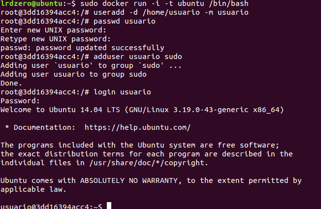
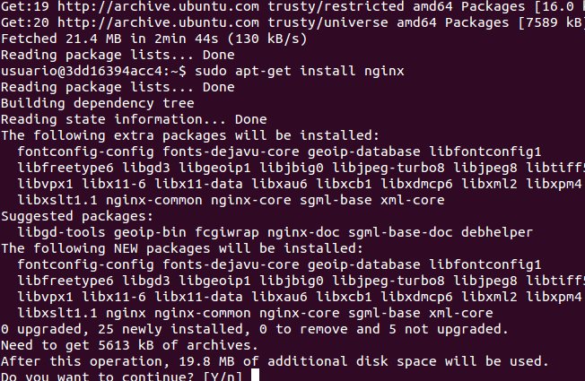

#Ejercicio 10

##Crear un usuario propio e instalar nginx en el contenedor creado de esta forma.

Iniciamos nuestro contenedor con docker y accedemos a bash mediante:

    udo docker run -i -t ubuntu /bin/bash
    
Creamos un usuario nuevo con useradd:

Tras esto procedemos a instalar ngnix:

    sudo apt-get update
    sudo apt-get install nginx

