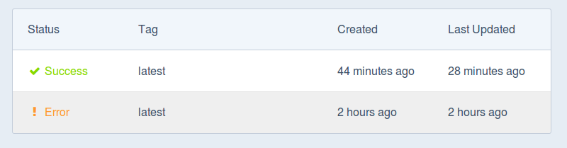
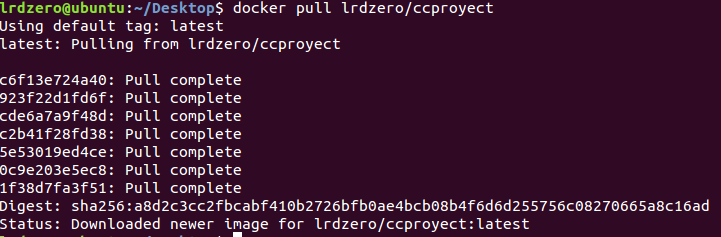

#Ejercicio 12

##Crear una imagen con las herramientas necesarias para el proyecto de la asignatura sobre un sistema operativo de tu elección.

Podemos llevarlo a cabo linkeando nuestro github con docker hub mediante la opcion create automated build.

Al linquear tenemos acceso a nuestros repositorios de GitHub.

Tras esto creamos un archivo Dockerfile dentro de nuestro donde tenemos el 

Tras hacer el push del Dockerfile si se ha linqueado correctamente se produce la actualización automáticamente.

Reconoce el Dockerfile

y finalmente construye la versión.

Finalmente si queremos bajarnoslo ejecutamos:

    sudo docker pull lrdzer/ccproyect
    

