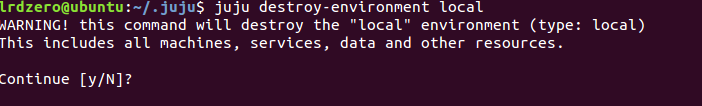
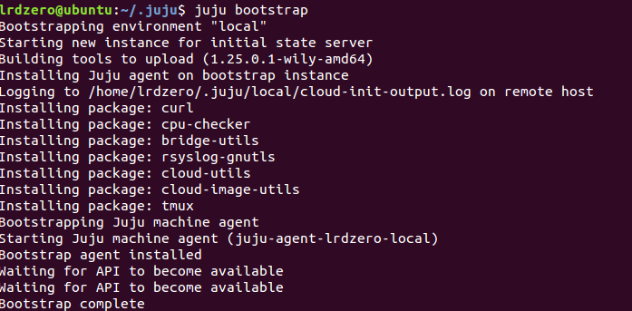
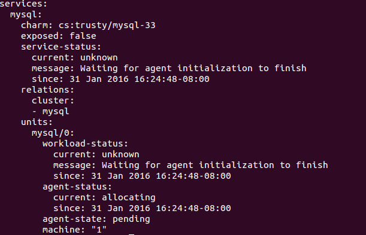
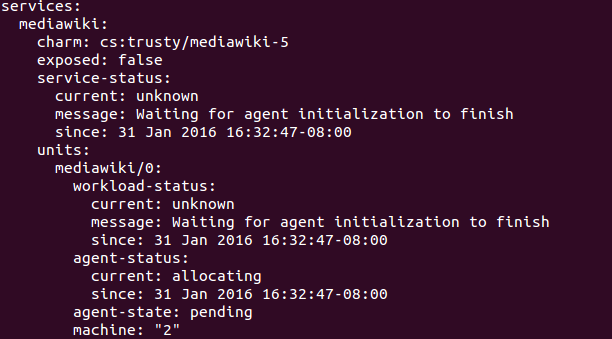

#Ejercicio 7

##Apartado A: Destruir toda la configuración creada anteriormente

Para destruir lo configurado anteriormente debemos usar:

    juju destroy-environment local
    

##Apartado B:Volver a crear la máquina anterior y añadirle mediawiki y una relación entre ellos.

Llevamos a cabo:

    juju bootstrap
    juju deploy mysql
    juju deploy mediawiki
    

